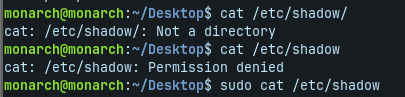

# 👤 Task 01 - User Management

## 📖 Overview

This project is a Bash script developed to automate basic Linux user management tasks. It validates user input, checks whether a user exists, and creates a new user if required. The script also maintains a log file for tracking user creation events.

---

## ✨ Features

- 🔐 Root privilege verification
- 👤 Username validation
- ❌ Prevents empty or invalid usernames
- 🔍 Checks if the user already exists
- ➕ Creates a new Linux user
- 📝 Maintains a log file (`LOG_FILE.txt`)
- ⚠️ Error handling with meaningful messages

---

## 🛠️ Technologies Used

- Bash Scripting
- Linux (Ubuntu / Zorin OS)
- Git & GitHub

---

## 📂 Project Structure

```
Task-01-User-Management/
│
├── README.md
├── user_management.sh
├── LOG_FILE.txt
└── screenshots/
```

---

## ▶️ How to Run

```bash
chmod +x user_management.sh
sudo ./user_management.sh
```

---

## 📸 Screenshots

### Main Screen


### User Created Successfully



### Log File


---

## 📄 Log File

The script records every successful user creation in `LOG_FILE.txt`.

Example:

```text
2025-08-07 14:30:10 | User Created | Username: rahul | Created By: root
```

---

## 🎯 Learning Objectives

This project helped me practice:

- Linux user management
- Bash scripting fundamentals
- Input validation
- Conditional statements
- Regular expressions
- Logging
- Error handling

---

## 👨‍💻 Author

**Anuj Kumar Jha**

Learning DevOps | Linux | Bash Scripting
